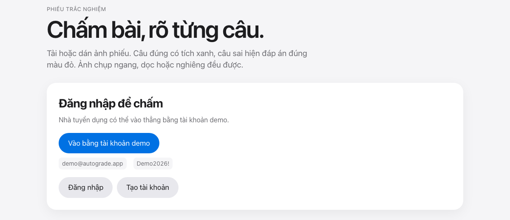
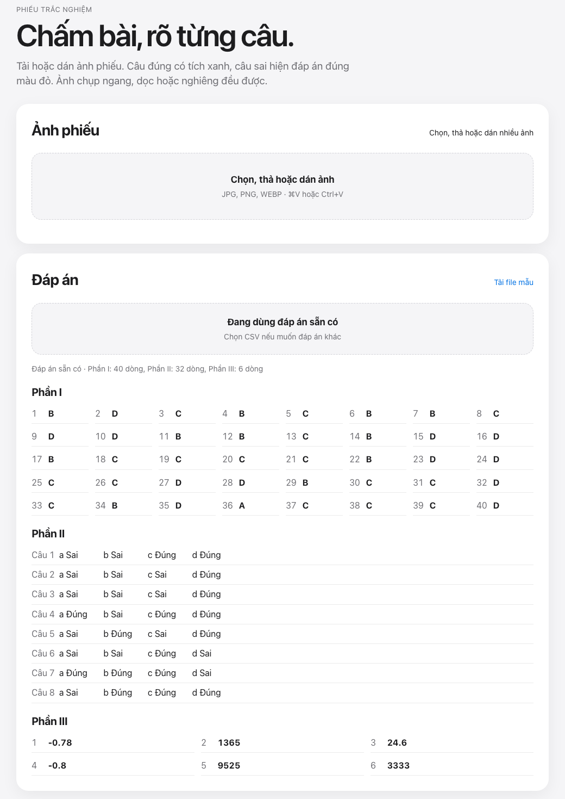
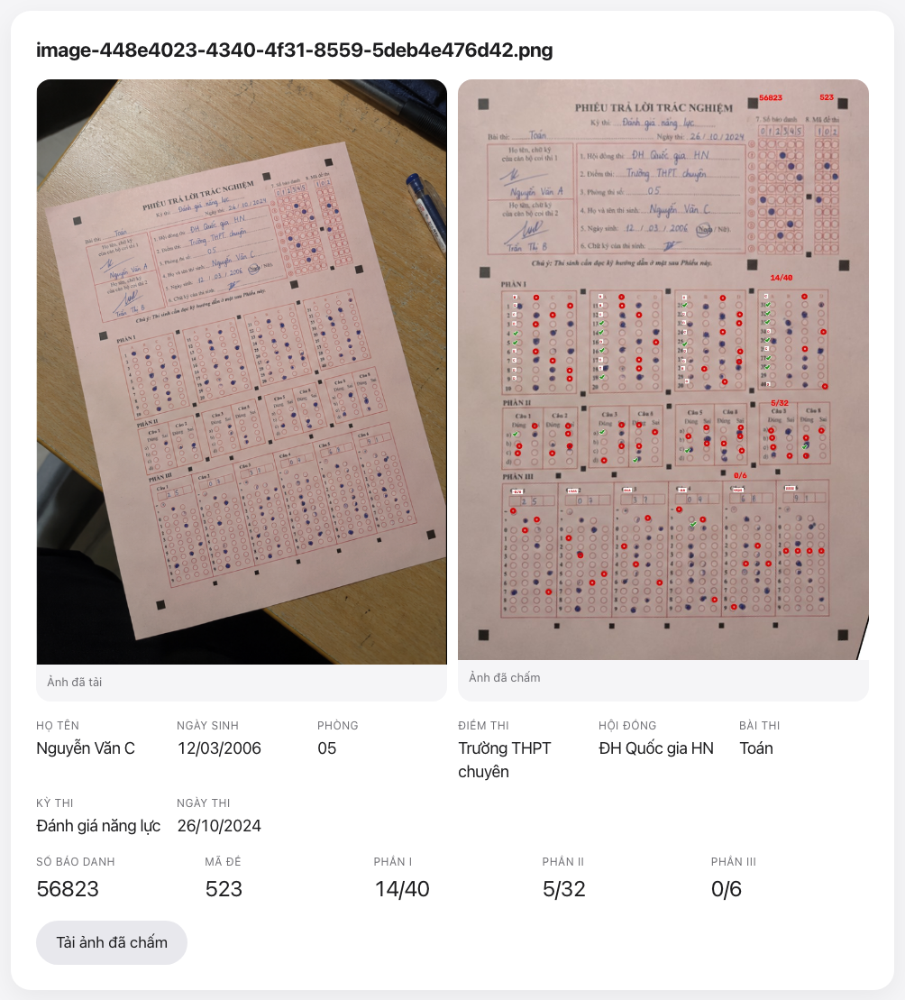
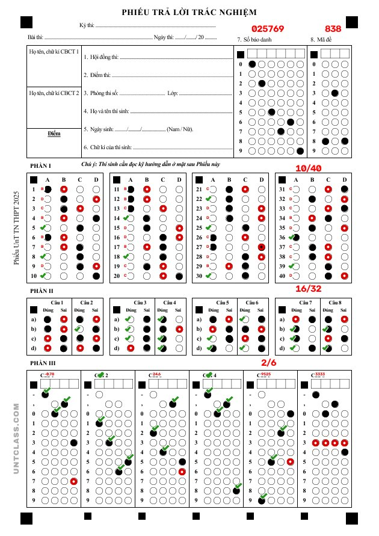
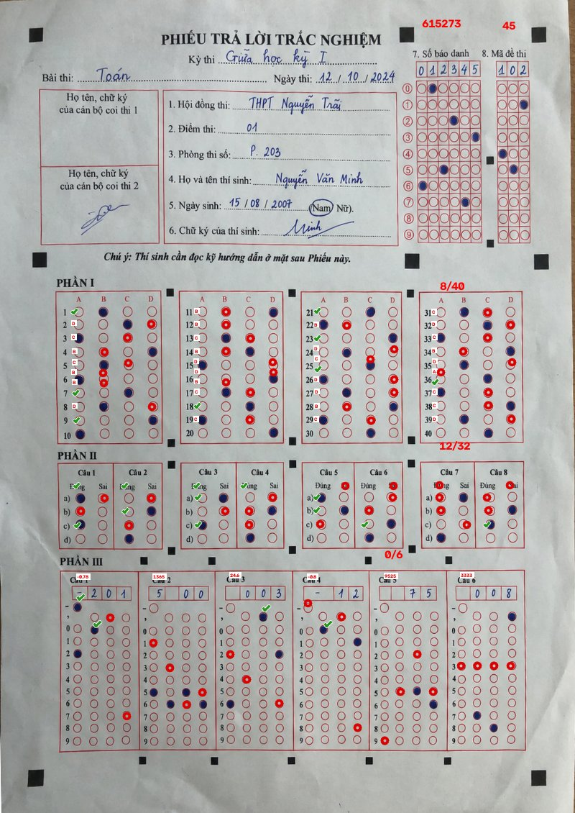
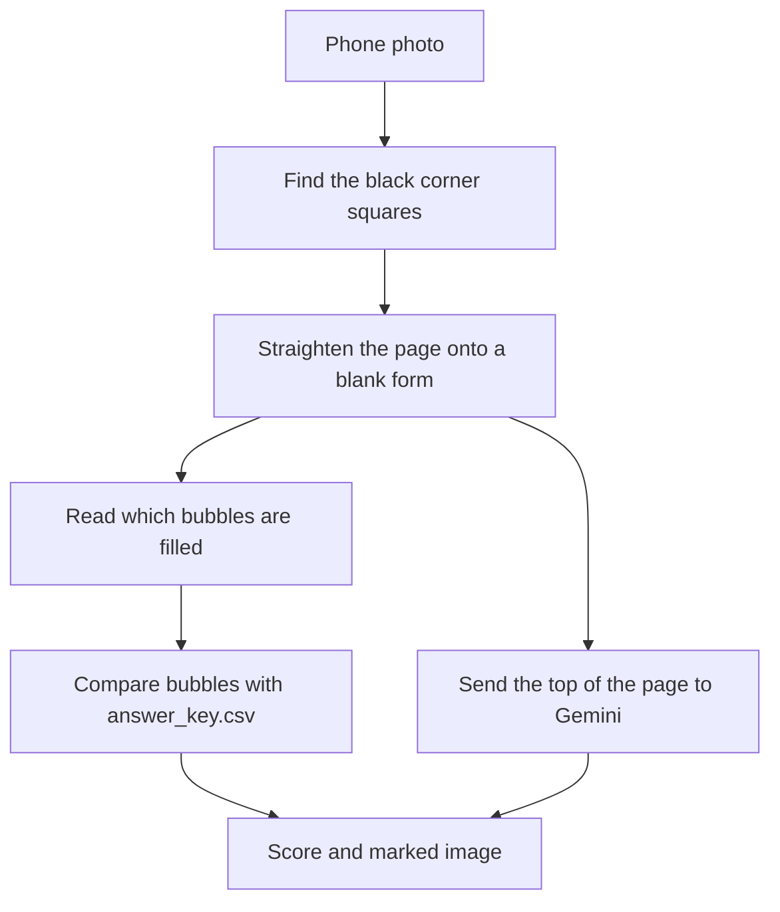

# Autograde

Autograde grades a Vietnamese multiple-choice answer sheet from a photo. You upload a picture of the sheet. The app straightens it, reads the filled bubbles, and compares them with an answer key. It also reads the handwritten name and other lines at the top of the sheet.

The website is in Vietnamese. A bubble is one of the small circles the student fills in. The answer key is the file of correct answers.

## Screenshots

The first screen is what a visitor sees. Grading is locked until someone logs in. A recruiter can use the demo account on that page.



After login, you drop in one or more sheet photos. You can also paste a picture from the clipboard. The built-in answer key is already listed, so you do not have to upload one.



This is a real desk photo after grading. The left picture is the upload. The right picture is the straightened sheet with marks. A green check sits on a correct bubble. A red ring shows the right answer when the student was wrong. The name, birth date, room, and school come from the handwriting. The student id and exam code come from the bubbles.



Two sheets from `dataset/` were graded with the built-in answer key. The marks land on the bubbles, and the scores match the numbers below.

`dataset/form2.png` is a filled scan of the classic form. Student id `025769`, exam code `838`. Part I `10/40`, Part II `16/32`, Part III `2/6`. The lines at the top of this sample are blank, so there is no handwritten name.



`dataset/Ảnh ChatGPT 14_46_34 30 thg 9, 2026.png` is a wrinkled phone photo of the form with many black squares. Student id `615273`, exam code `45`. Part I `8/40`, Part II `12/32`, Part III `0/6`. Part III is `0/6` because those answers are not the sample key. The sheet was still read.



`dataset/form1.png` and `dataset/form_markers.png` are blank forms. Nothing is filled in, so they score `0/40`, `0/32`, `0/6` and the student id is empty. They are the templates the aligner uses, not example results.

## What you can do

- Grade up to 20 photos in one submit. One photo is one student. Choosing, dropping, or pasting again adds to the list. It does not throw away the photos you already picked. Each preview has a Bỏ button if you added the wrong file.
- Grade a photo that is portrait, landscape, tilted, larger, or smaller than the sample. The four black squares at the outer corners of the sheet must stay in the picture.
- Grade the classic sheet (four big corner squares) and the sheet that has many smaller black squares. Both have the same three parts.
- See a mark on every question, not only the total.
- Read the handwritten header: subject, exam name, date, council, school, room, student name, and birth date.
- Register an account, or sign in with the demo account.
- Upload your own answer key as a CSV file (a plain-text table, one row per answer). If you skip that, the app uses `answer_key.csv`.

Part I is 40 questions, A to D. Part II is 8 questions, each with four true/false items. Part III is 6 numeric answers. The student id is up to 6 digits. The exam code is up to 3 digits.

## Run it on your computer

You need Conda and Python 3.10.

```bash
git clone https://github.com/quocbao2772004/AUTOGRADE.git
cd AUTOGRADE

conda create -n autograde python=3.10 pip -y
conda activate autograde
pip install -r requirements.txt
```

If the `autograde` environment already exists, activate it and run `pip install -r requirements.txt` again.

Handwriting is read by Gemini, through the API address in your env file. Copy this into a file named `.env` in the project folder. Do not commit that file. It is already listed in `.gitignore`.

```bash
GEMINI_API_KEY=your-key-here
base_url=https://api.yescale.io
```

A key from [Google AI Studio](https://aistudio.google.com/apikey) also works. For that key, set `base_url` to `https://generativelanguage.googleapis.com`.

Start the site:

```bash
python web/app.py
```

Open http://127.0.0.1:5050

The demo account is `demo@autograde.app` / `Demo2026!`. The same button is on the home page.

The app listens only on your own computer (`127.0.0.1`, port `5050`). Uploaded photos for one visit are stored in `/tmp/autograde-web` and are not kept in git. Accounts are stored in `web/data/app.sqlite`, which is also gitignored.

## How a photo becomes a score



1. **Find the page.** The program looks for the black squares printed on the sheet. It uses the four outer squares, even when the sheet has extra squares along the edges.
2. **Straighten it.** A tilted photo is stretched so it lines up with a blank form. There are two blank forms in `dataset/`: `form2.png` (four big corners) and `form_markers.png` (many squares). The program tries both and keeps the one that lines up better.
3. **Read the bubbles.** A bubble counts as filled when the inside of the circle is dark enough. Pencil and blue pen both count. An empty column in the student id or exam code stays blank. It does not become `0`.
4. **Fix small shifts.** On a wrinkled photo, the printed circles can sit a few pixels away from the pen marks. The program nudges each row onto the marks. It does not rebuild the whole grid from scratch.
5. **Score.** Each answer is compared with `answer_key.csv`. The marked image gets a green check or a red ring.
6. **Read the handwriting.** After the page is straight, the app cuts off the top (the lined blanks above Part I) and sends that crop to Gemini. The model is `gemini-2.5-flash-lite`. The student id and exam code are not taken from this step. Those still come from the bubbles, because the handwritten boxes above the bubbles are often just column labels.

If Gemini is down, or the key is missing, the bubble score is still returned. The page shows a short note instead of the name.

The folder `model/` is an older experiment: a small neural network (a CNN) saved in `model/weight.h5`. The grader does not load it. Bubbles are read by measuring darkness with OpenCV, a Python library for images. TensorFlow is still in `requirements.txt` because that old file imports it. Installing it makes the environment large. Grading does not need a GPU.

## Where the code lives

| Path | What it is |
| --- | --- |
| `web/app.py` | The website, built with Flask. Login, upload, grading, and the result page |
| `web/templates/` | HTML for the pages |
| `web/static/style.css` | Layout and colors |
| `code/process_image.py` | Straighten the photo, read bubbles, draw marks |
| `code/handwriting.py` | Call Gemini for the handwritten header |
| `answer_key.csv` | The built-in correct answers |
| `dataset/form1.png` | Blank classic form, used to measure bubble positions |
| `dataset/form2.png` | Filled classic sample |
| `dataset/form_markers.png` | Blank form with many black squares |
| `model/` | Old CNN experiment. Not used while grading |

## Prepare the answer key

One CSV file is the key for every photo in that upload. All of those students must have sat the same exam code. If the room has two exam codes, upload the photos in two batches, each with its own CSV.

The built-in file `answer_key.csv` is a full example: 40 rows for Part I, 32 rows for Part II, and 6 rows for Part III. Download it from the site ("Tải file mẫu"), then change the `Answer` column. A question you leave out cannot score, and the total is still out of 40, 32, and 6.

### Make the file

1. Open Excel, Google Sheets, or Numbers.
2. Put this header in row 1. The names have to match, including the hyphen in `Sub-question`. Do not add a title above this row.

```csv
Section,Question,Sub-question,Answer
```

3. Fill one answer per row. Do not merge cells.
4. Save as **CSV UTF-8 (Comma delimited)**. A Vietnamese copy of Excel sometimes saves semicolons instead of commas. The app accepts both. Other separators are rejected.

### What each column means

| Column | What to write |
| --- | --- |
| `Section` | `I`, `II`, or `III`. Not `1`, and not `Phần I`. |
| `Question` | The question number: 1 to 40, 1 to 8, or 1 to 6. |
| `Sub-question` | Leave empty for Part I and Part III. For Part II write `a`, `b`, `c`, or `d` in lowercase. |
| `Answer` | The correct value, described below. |

### Part I

Forty rows. `Sub-question` stays empty. `Answer` is one letter: `A`, `B`, `C`, or `D`.

```csv
Section,Question,Sub-question,Answer
I,1,,B
I,2,,D
I,3,,C
```

Keep going until question 40.

### Part II

Eight questions, and each question has four rows (`a` `b` `c` `d`). That is 32 rows. `Answer` is `True` or `False`. The site shows these words as Đúng and Sai. Write the English words in the file.

```csv
II,1,a,False
II,1,b,False
II,1,c,True
II,1,d,True
II,2,a,False
```

Keep going until question 8, item `d`.

### Part III

Six rows. `Sub-question` stays empty. `Answer` is the number the student should have bubbled, with `-` or `.` when the real answer has them. No spaces.

```csv
III,1,,-0.78
III,2,,1365
III,3,,24.6
III,4,,-0.8
III,5,,9525
III,6,,3333
```

`-0.78` is not the same as `0.78` or `-0.780`. Copy the answer the way it is printed on the key.

### A short file that shows the shape

This is only a sample of the shape. A real file needs the rest of the questions too.

```csv
Section,Question,Sub-question,Answer
I,1,,B
I,2,,D
II,1,a,False
II,1,b,False
II,1,c,True
II,1,d,True
III,1,,-0.78
III,2,,1365
```

If the site says the file is missing columns, the header row is wrong or the separator is not a comma or a semicolon.

## Check the install

This command grades the filled sample and writes two images into `outputs/`.

```bash
python code/process_image.py dataset/form2.png
```

You should see:

```text
part1: 10/40
part2: 16/32
part3: 2/6
student_id: 025769
exam_code: 838
```

`outputs/form2_aligned.jpg` is the straightened page. `outputs/form2_graded.jpg` is the page with marks. The header lines on that sample are blank, so the name fields are empty. That is expected.

Other useful flags:

```bash
python code/process_image.py path/to/photo.jpg --show
python code/process_image.py path/to/photo.jpg --output outputs/result.jpg
python code/process_image.py path/to/photo.jpg --debug-dir outputs/debug
python code/process_image.py path/to/photo.jpg --no-align
```

`--no-align` skips straightening. Use it only when the picture is already a flat scan of the form. `--debug-dir` saves the corner detection and the straightened page so you can see why a photo failed.

## Settings

| Variable | Meaning |
| --- | --- |
| `GEMINI_API_KEY` | Key for the handwriting call. Required for names. Not required for bubble scores. |
| `base_url` or `GEMINI_BASE_URL` | API address. Default is `https://api.yescale.io`. |
| `GEMINI_MODEL` | Optional. Default is `gemini-2.5-flash-lite`. |

A variable set in the server environment wins over the same name in `.env`. Keep the key on the server. The browser never sees it.

## When a photo is rejected

The page says it cannot line the sheet up when the black corner squares are missing, covered, or cut off. Take another picture with all four outer squares visible, and keep the answer area in frame.

A very blurry or very dark photo can line up and still mark the wrong bubbles. The marked image is there so a person can check.
