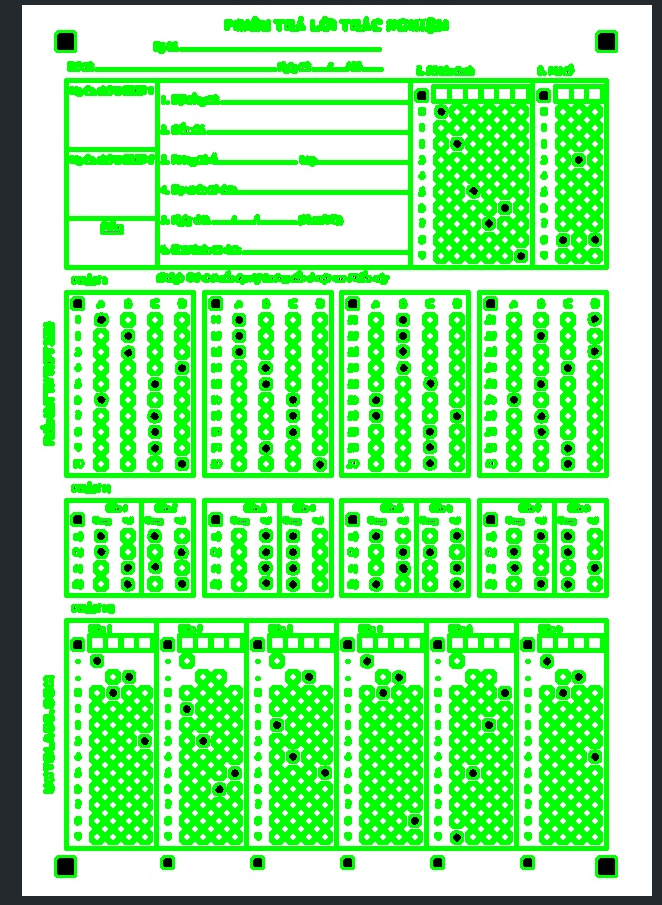
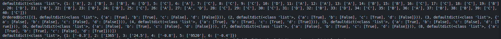
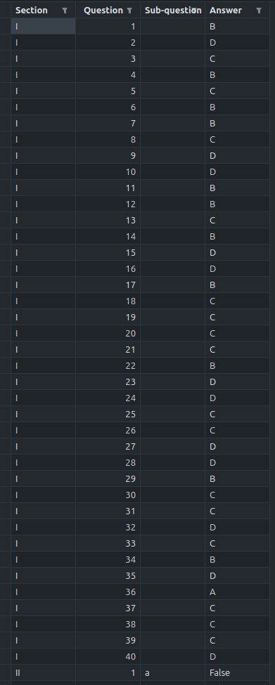

# AUTOGRADE

AUTOGRADE là công cụ chấm phiếu trả lời trắc nghiệm bằng xử lý ảnh và mô hình CNN. Project đọc ảnh phiếu, tự căn chỉnh ảnh theo 4 marker góc, tách các vùng đáp án, nhận diện ô đã tô và so sánh với đáp án trong `answer_key.csv`.

## Tính năng chính

- Chấm phiếu từ ảnh scan hoặc ảnh chụp điện thoại.
- Tự xử lý ảnh bị xoay 90/180/270 độ.
- Tự nắn phối cảnh khi ảnh chụp bị nghiêng.
- Chấp nhận ảnh có thêm viền trắng hoặc bị cắt bớt viền nhẹ, miễn là còn thấy đủ 4 ô vuông đen ở góc phiếu.
- Xuất ảnh đã căn chỉnh và ảnh đã ghi điểm vào thư mục `outputs/`.
- Hỗ trợ debug bằng ảnh contour/alignment để kiểm tra lỗi crop hoặc lỗi nhận marker.

## Công nghệ sử dụng

- Python
- OpenCV
- TensorFlow/Keras
- NumPy
- Pandas
- imutils

## Cài đặt

Yêu cầu có Conda trên máy.

```bash
git clone https://github.com/quocbao2772004/AUTOGRADE.git
cd AUTOGRADE

conda create -n autograde python=3.10 pip -y
conda activate autograde
pip install -r requirements.txt
```

Nếu đã có environment `autograde`, chỉ cần:

```bash
conda activate autograde
pip install -r requirements.txt
```

## Cách chạy

Chấm một ảnh phiếu bất kỳ:

```bash
python code/process_image.py path/to/student_photo.jpg
```

Ví dụ với ảnh mẫu trong repo:

```bash
python code/process_image.py dataset/form2.png
```

Script sẽ lưu kết quả mặc định vào:

```text
outputs/<ten_anh>_aligned.jpg
outputs/<ten_anh>_graded.jpg
```

Trong đó:

- `_aligned.jpg`: ảnh đã được xoay/nắn phối cảnh về form chuẩn.
- `_graded.jpg`: ảnh đã được ghi điểm, số báo danh và mã đề.

## Tuỳ chọn CLI

Hiển thị ảnh kết quả bằng OpenCV:

```bash
python code/process_image.py path/to/student_photo.jpg --show
```

Chỉ định nơi lưu ảnh kết quả:

```bash
python code/process_image.py path/to/student_photo.jpg --output outputs/result.jpg
```

Lưu ảnh debug contour/alignment:

```bash
python code/process_image.py path/to/student_photo.jpg --debug-dir outputs/debug
```

Bỏ qua bước căn chỉnh tự động, chỉ dùng khi ảnh đã là form chuẩn:

```bash
python code/process_image.py path/to/student_photo.jpg --no-align
```

## Dữ liệu đầu vào

Ảnh đầu vào nên đảm bảo:

- Thấy đủ 4 ô vuông đen ở 4 góc phiếu.
- Phiếu không bị che khuất vùng đáp án.
- Ảnh không quá mờ hoặc quá tối.
- Nếu crop ảnh, không crop vào 4 marker góc.

Nếu marker góc bị mất hoặc bị cắt quá nhiều, chương trình sẽ báo lỗi dạng:

```text
Alignment confidence too low (...). Make sure all four black corner markers are visible and not cropped.
```

## Đáp án

Đáp án đúng được đọc từ:

```text
answer_key.csv
```

Các cột chính:

- `Section`: phần của đề, ví dụ `I`, `II`, `III`.
- `Question`: số câu.
- `Sub-question`: ý nhỏ, dùng cho phần II.
- `Answer`: đáp án đúng.

## Output và debug

Các file runtime được sinh trong `outputs/`:

```text
outputs/
  <ten_anh>_aligned.jpg
  <ten_anh>_graded.jpg
  debug/
    aligned_sheet.jpg
    all_contours.jpg
    highlighted_contours.jpg
  cropped_images/
    form/
```

Thư mục `outputs/` được ignore khỏi Git vì chỉ là kết quả chạy local.

## Kiểm thử đã chạy

Pipeline đã được kiểm thử với các biến thể từ `dataset/form2.png`:

- Ảnh gốc.
- Xoay 90/180/270 độ.
- Xoay lệch nhẹ `+8` và `-13` độ.
- Thêm viền trắng đều và lệch.
- Cắt bớt viền 10px, 20px, 25px nhưng vẫn giữ marker.
- Ảnh phối cảnh giả lập kiểu chụp điện thoại.

Các trường hợp trên đều cho cùng kết quả:

```text
part1: 10/40
part2: 16/32
part3: 2/6
student_id: 025769
exam_code: 838
```

Trường hợp crop vào marker góc sẽ bị từ chối sớm bằng lỗi alignment confidence thấp.

## Preview

Detect table:



CNN detect marked cells:



Answer table:



Autograde result:


